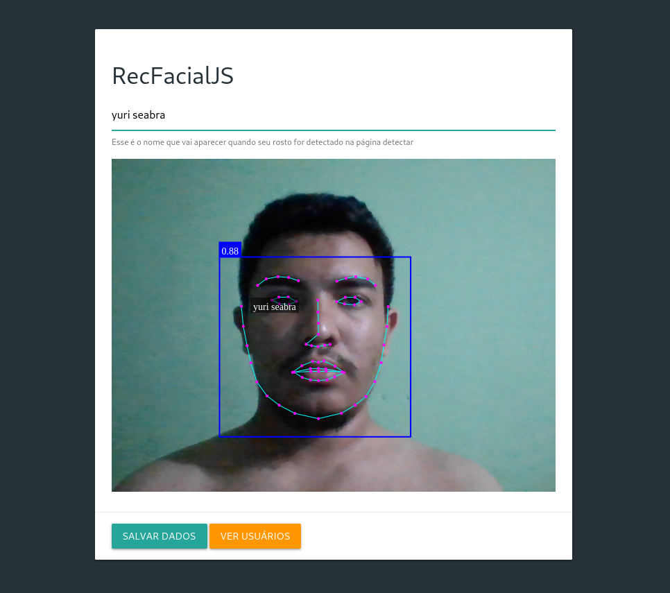

# RecFacialJS

Aplicação web de reconhecimento facial, utilizando FaceApi.js

## Introdução

Este projeto é um estudo prático da biblioteca <a href="https://github.com/justadudewhohacks/face-api.js">face-api.js</a> para web, que contém várias ferramentas desenvolvidas em Javascript para reconhecimento facial. Para guardar os dados escaneados, foi utilizado a propriedade _localStorage_, que funciona como um banco de dados local da linguagem. Na estilização, foi utilizada a biblioteca <a href="https://github.com/dogfalo/materialize">Materialize</a>.

## Preview

